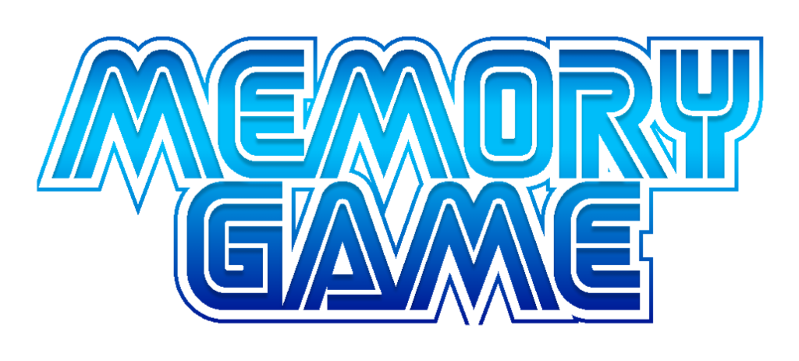

### Hi there / Olá 👋

ENG: Welcome to my GitHub profile, my name is Arthur de Moura Fontes, I'm 25 years old, I'm a student at Proz Educação in the city of Juiz de Fora, Minas Gerais, Brazil and I'm learning about programming in general, its fundamentals and practices.

PT-BR: Seja bem vindo ao meu perfil do GitHub, me chamo Arthur de Moura Fontes, tenho 25 anos, sou aluno da Proz Educação da cidade de Juiz de Fora, Minas Gerais, Brasil e estou aprendendo sobre programação em geral, fundamentos e práticas dos mesmos.

<h1 align="center"> Play the Sonic Memory Game </h1>

  <a href="https://github.com/ArthurFontes762">
  
  

### 😄 Pronouns: He/Him
### 🌱 I’m currently learning Systems Development

- :mailbox: How to find me:
  - :office: [Linkedin](linkedin.com/in/arthur-de-moura-fontes/)

### 🤔 Ongoing projects

- <a target="_blank" href="https://github.com/ArthurFontes762/ShiandeGames-Moralizadas">
- <a target="_blank" href="https://github.com/BrunoDG/Moralizada_ShiandeGames">

<!--
**ArthurFontes762/ArthurFontes762** is a ✨ _special_ ✨ repository because its `README.md` (this file) appears on your GitHub profile.

Here are some ideas to get you started:

- 🔭 I’m currently working on ...
- 🌱 I’m currently learning ...
- 👯 I’m looking to collaborate on ...
- 🤔 I’m looking for help with ...
- 💬 Ask me about ...
- 📫 How to reach me: ...
- 😄 Pronouns: ...
- ⚡ Fun fact: ...
-->
